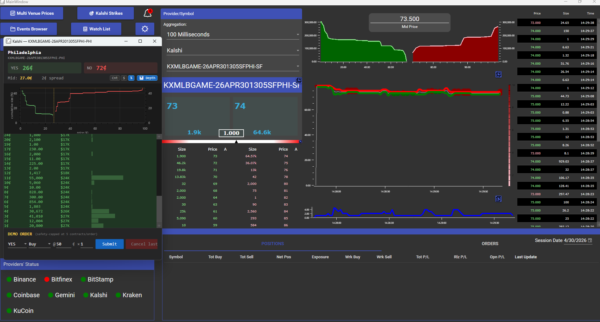
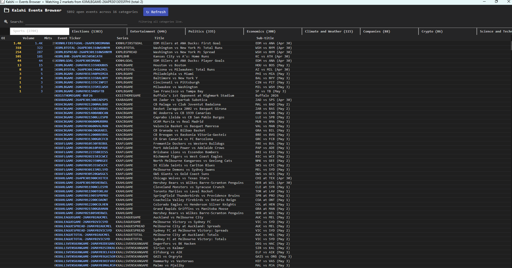

# Kalshi Setup

This fork of [VisualHFT](https://github.com/visualHFT/VisualHFT) adds UI
windows and helpers for trading prediction markets on
[Kalshi](https://kalshi.com): strike ladder, per-market ladder, events
browser, watch list, implied PMF, depth chart, and a demo-only order panel.

The UI lives in **this repo**. The actual data-feed plugin (Kalshi WebSocket
/ REST → VisualHFT order books and trades) lives in a **separate repo**
that also bundles a vendored copy of this fork for one-clone setup:

- Bundle (recommended): <https://github.com/Paulo-BatistaFerraz/VisualHFT-Kalshi>
- This UI fork only: <https://github.com/Paulo-BatistaFerraz/VisualHFT>

Cloning this repo alone gets you the Kalshi UI, but no data will appear
until the plugin DLL is built (from the bundle repo) and dropped into
VisualHFT's plugin folder.

## Screenshots

### Main window



VisualHFT running with the Kalshi plugin loaded. Top toolbar exposes Kalshi
entry points (**Multi Venue Prices**, **Kalshi Strikes**, **Events Browser**,
**Watch List**). The floating ladder shows a per-market view of an MLB strike
contract (`KXMLBGAME-26APR301305SFPHI-PHI` — Philadelphia, YES 26¢ / NO 72¢,
2¢ spread) with a cumulative-depth chart and a price ladder rendered with
the same `OrderBook` bus the rest of the app uses. The center pane shows the
provider/symbol picker, mid-price tile, and live depth ladder; the right
pane is the standard VisualHFT depth chart, best-bid/offer time series,
spread chart, and live trade tape. Bottom strip is a demo-only order panel
(safety-capped at 5 contracts/order). Kalshi appears in the **Providers'
Status** row alongside the existing crypto venues.

### Events Browser



Live catalog of every open Kalshi event grouped by the API's `category`
field — Sports (2,704), Elections (1,383), Entertainment (646), Politics
(335), Economics (308), Climate & Weather, Companies, Crypto, Science &
Tech, etc. Type-ahead search filters across **all** categories
simultaneously. Each event shows aggregate open interest, volume, and
market count; double-click an event to start streaming its markets into
the live ladder without editing the plugin's static ticker list.

## Configure Kalshi credentials

Nothing is hardcoded — supply your own via environment variables. Generate
a key pair from Kalshi's web UI (<https://kalshi.com> for prod or
<https://demo.kalshi.co> for demo) → Profile → **API Keys** → **Create new
API key**. Save the private key Kalshi shows (one-time display) and the
key id somewhere outside this repo, then set:

```powershell
# Prod (read-only Events Browser, Watch List, Strike/Per-market ladder data)
$env:KALSHI_PROD_KEY_ID   = "<your prod key id>"
$env:KALSHI_PROD_PEM_PATH = "C:\path\to\your\kalshi-prod.pem"

# Demo (in-app order panel)
$env:KALSHI_DEMO_KEY_ID   = "<your demo key id>"
$env:KALSHI_DEMO_PEM_PATH = "C:\path\to\your\kalshi-demo.pem"
```

Both scopes are independent — view-only features run without demo creds,
and the order panel throws a clear error pointing at the missing variable
if you haven't set demo. Without prod creds the polling helpers log a
warning and skip work instead of crashing the app.

The credential reader and error messages live in
[`Helpers/KalshiCredentials.cs`](Helpers/KalshiCredentials.cs).

## What this fork adds vs. upstream

Approximately 3.4k lines added, additive only — no upstream files removed.

- `View/Kalshi*Window.xaml(.cs)` — strike ladder, per-market ladder, events
  browser, watch list, implied PMF.
- `ViewModel/vmKalshi*.cs` — view-models backing those windows.
- `Helpers/Kalshi*.cs` — supplemental browser-poller (richer prod book),
  event catalog, demo trade helper, plus a small `KalshiCredentials`
  resolver used by all three.
- Small tweaks to `View/Dashboard.xaml(.cs)`, `View/ucDepth1.xaml`,
  `ViewModel/vmOrderBook.cs`, and `VisualHFT.Commons/UserSettings/enums.cs`
  to wire up the Kalshi UI and persist settings.

See <https://github.com/Paulo-BatistaFerraz/VisualHFT-Kalshi> for the
plugin side and the bundled deliverable.
